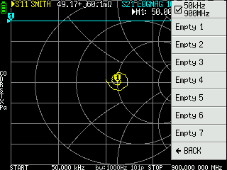

NanoVNA - Modifications for devices without SD card
===================================================

# About

This repository contains the source of NanoVNA firmware based on
[DiSlord's development](https://github.com/DiSlord/NanoVNA-D)
with *8-calibration-slot* modification for NanoVNA-H devices without SD card
as well as `bin`, `hex` and `dfu` firmware ready for download.

## Prepare ARM Cross Tools

### Debian

Do this once:

    $ sudo apt install gcc-arm-none-eabi
    $ sudo apt install -y dfu-util

## Fetch source code

Fetch source and submodule once:

    git clone https://github.com/Ho-Ro/NanoVNA-D.git
    cd NanoVNA-D
    git submodule update --init --recursive
    git checkout NanoVNA_noSD

Keep your source code up to date:

    git pull

## Build

Just type in the directory.

    make -j

## Flash firmware

First, connect the device and enter DFU mode by one of following methods.

* `make dfu` (assumed the NanoVNA is on `/dev/ttyACM0`).
* Select menu Config->DFU (needs recent firmware).
* Jumper BOOT0 pin to VDD at powering device.
* With a minor HW modification just press jog switch while powering
(solder a wire from BOOT0 to the center pin of the jog switch).

Then, flash firmware using dfu-util via USB.

    dfu-util -d 0483:df11 -a 0 -s 0x08000000:leave -D NanoVNA-H-noSD.bin

Or simply type:

    make flash

## Parse the menu structure

This is a quick tool to show the menu structure of the FW with all possible menu entries:

    parse_menu.py

## Credit
* [@DiSlord](https://github.com/DiSlord/)

## Based on code from:
* [@edy555](https://github.com/edy555)

### Contributors
* [@OneOfEleven](https://github.com/OneOfEleven)
* [@hugen79](https://github.com/hugen79)
* [@cho45](https://github.com/cho45)

